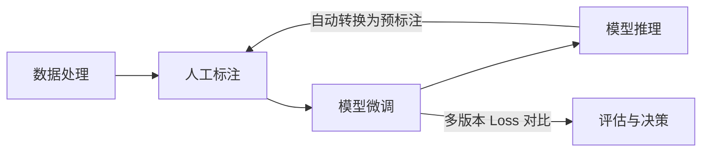

# TS-Iteration-Loop 时序异常检测迭代循环系统

> 整合数据获取、标注、微调、推理四大模块，打通全链路反馈闭环的统一迭代平台。

## 项目状态

🟢 **MVP 完成** - 已实现完整的迭代循环：数据→标注→微调→推理→再标注

## 核心流程 (反馈闭环)



## 功能模块

| 模块 | 状态 | UI 入口 |
|------|------|---------|
| **数据服务** | ✅ 完成 | `/train-ui` → 📁 数据获取 |
| **标注服务** | ✅ 完成 | `/train-ui` → 🏷️ 标注工具 |
| **微调服务** | ✅ 完成 | `/train-ui` → 🎯 开始训练 |
| **推理服务** | ✅ 完成 | `/train-ui` → 🔍 推理监控 |
| **迭代管理** | ✅ 完成 | `/api/v1/iteration` |

## 🚀 快速开始

### 本地启动

```bash
# 安装依赖
pip install -i https://pypi.tuna.tsinghua.edu.cn/simple -r requirements.txt

# 启动服务
./scripts/start.sh all
```

### 访问地址

| 入口 | 地址 |
|------|------|
| **统一管理界面** | http://localhost:8000/train-ui |
| **API 文档** | http://localhost:8000/docs |
| **标注工具** | http://localhost:5000 |

## 📊 UI 界面

| Tab | 功能 |
|-----|------|
| 📁 数据获取 | 数据集列表、曲线预览、采集配置 |
| 🔍 推理监控 | 任务创建、状态监控 |
| 🏷️ 标注工具 | 跳转到标注工具 |
| 🎯 开始训练 | 微调参数配置 |
| 📊 已训练模型 | 模型详情、Loss 曲线 |
| ⚖️ 模型对比 | 多模型对比图 |

## 🏗️ 技术栈

- **Backend**: FastAPI + Python 3.10+
- **Frontend**: Gradio
- **Worker**: Celery
- **Storage**: SQLite

## 📁 目录结构

```
ts-iteration-loop/
├── src/
│   ├── api/         # 业务接口 (data, annotation, training, inference, iteration)
│   ├── adapters/    # 外部项目适配器
│   ├── core/        # 任务引擎
│   ├── webui/       # Gradio 界面
│   └── main.py      # 入口
└── docs/            # 文档
```

---

- [开发文档](DEVELOPMENT.md) | [API 说明](API.md) | [更新日志](CHANGELOG.md)
