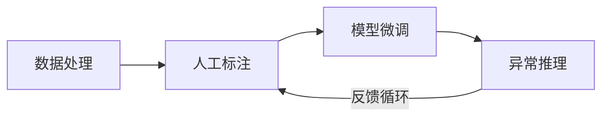

# TS-Iteration-Loop 时序异常检测迭代循环系统

> 整合数据获取、标注、微调、推理四大模块的统一迭代平台。

## 项目状态

� **Phase 2 完成** - 已集成微调界面与任务驱动流程。

## 核心流程



## 功能模块

| 模块 | 状态 | 技术实现 |
|------|------|----------|
| **数据服务** | ✅ 完成 | 封装 `Data-Processing` 脚本 |
| **标注服务** | ✅ 完成 | 集成 `timeseries-annotator-v2` |
| **微调服务** | ✅ 完成 | Gradio UI 封装 `ChatTS-Training` |
| **推理服务** | ✅ 完成 | 封装 `check_outlier` 项目 |
| **任务队列** | ✅ 完成 | Celery + Redis 异步执行 |
| **迭代反馈** | 🟡 进行中 | 推理结果自动回流标注端 |

## 🚀 快速开始

### 方式 1：Docker 部署 (推荐)

```bash
cd /home/douff/ts/ts-iteration-loop
docker-compose up -d
```

### 方式 2：本地启动

```bash
# 启动所有服务 (App + Celery Worker)
./scripts/start.sh all
```

访问地址：
- **微调界面**: [http://localhost:8000/train-ui](http://localhost:8000/train-ui)
- **API 文档**: [http://localhost:8000/docs](http://localhost:8000/docs)

## 🏗️ 架构概览

- **Backend**: FastAPI (Python)
- **Frontend/UI**: Gradio (微调管理) + Vue (外部标注工具)
- **Worker**: Celery (处理耗时训练/推理)
- **Storage**: SQLite + Redis (任务 Broker)

## 📁 目录结构

```text
ts-iteration-loop/
├── src/
│   ├── api/            # FastAPI 路由 (data/annotation/training/inference)
│   ├── adapters/       # 外部项目兼容层
│   ├── core/           # 任务引擎 (Celery) 与 监控器
│   ├── webui/          # Gradio 界面定义
│   ├── db/             # 数据库模型与初始化
│   └── main.py         # 统一入口
├── scripts/            # 启动与自动化脚本
├── configs/            # 全局配置管理
└── docs/               # 详细文档 (API/Development)
```

---

## 相关资源

- [开发路线图](docs/DEVELOPMENT.md)
- [API 详细说明](docs/API.md)
- [LlamaFactory 调研报告](docs/REVIEW_LLAMAFACTORY.md)

---
GitHub: [dff652/ts-iteration-loop](https://github.com/dff652/ts-iteration-loop)
