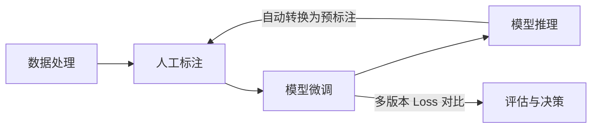

# TS-Iteration-Loop 时序异常检测迭代循环系统

> 整合数据获取、标注、微调、推理四大模块，打通全链路反馈闭环的统一迭代平台。

## 项目状态

🟢 **Phase 3 完成** - 已实现推理结果自动回传标注端的反馈闭环，并支持多模型版本对比。

## 核心流程 (反馈闭环)



## 功能模块

| 模块 | 状态 | 技术实现 |
|------|------|----------|
| **数据服务** | ✅ 完成 | 封装 `Data-Processing` 脚本 |
| **标注服务** | ✅ 完成 | 集成 `timeseries-annotator-v2` |
| **微调服务** | ✅ 完成 | Gradio UI 封装 `ChatTS-Training`，支持多版本对比 |
| **推理服务** | ✅ 完成 | 封装 `check_outlier` 项目 |
| **任务队列** | ✅ 完成 | Celery + Redis 异步执行 |
| **迭代反馈** | ✅ 完成 | **[New]** 推理结果自动回流标注端作为预标注 |

## 🚀 快速开始

### 方式 1：Docker 部署 (推荐)

```bash
cd /home/douff/ts/ts-iteration-loop
docker-compose up -d
```

### 方式 2：本地启动

```bash
# 安装依赖 (推荐使用国内镜像源)
pip install -i https://pypi.tuna.tsinghua.edu.cn/simple -r requirements.txt

# 启动所有服务 (App + Celery Worker)
./scripts/start.sh all
```

访问地址：
- **微调 & 对比界面**: [http://localhost:8000/train-ui](http://localhost:8000/train-ui)
- **API 文档**: [http://localhost:8000/docs](http://localhost:8000/docs)

## 🏗️ 架构概览

- **Backend**: FastAPI (Python)
- **Forwarding UI**: Gradio (微调状态、进度监控、多模型 Loss 曲线对比)
- **Worker**: Celery (处理耗时训练/推理)
- **Storage**: SQLite (任务状态管理) + Redis (任务 Broker)

## 📁 主要目录

```text
ts-iteration-loop/
├── src/
│   ├── api/            # 核心业务接口
│   ├── adapters/       # 外部子项目适配器
│   ├── core/           # 任务引擎与进度监控
│   ├── webui/          # Gradio 训练与对比界面
│   └── main.py         # 统一入口
├── scripts/            # 启动脚本与集成测试 (test_feedback_loop.py)
└── docs/               # 详细开发文档与 API 说明
```

---

## 相关资源

- [开发日志与里程碑](docs/DEVELOPMENT.md)
- [API 详细说明](docs/API.md)
- [推理反馈回路设计](docs/DEVELOPMENT.md#phase-3-进展)

---
GitHub: [dff652/ts-iteration-loop](https://github.com/dff652/ts-iteration-loop)
