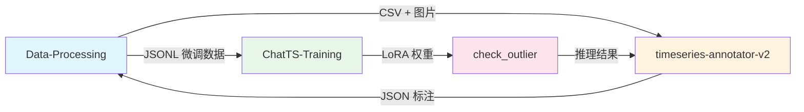
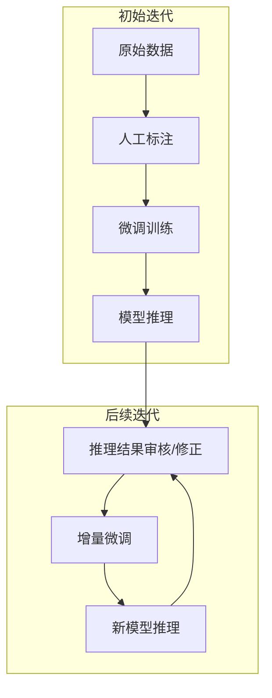
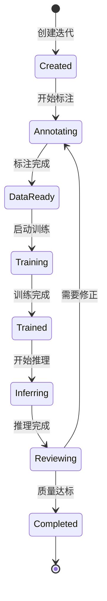

# 时序异常检测迭代循环系统 - 开发规划文档

> 版本：v1.0  
> 更新时间：2026-01-20

---

## 1. 技术可行性评估

### 1.1 现有资产分析

| 项目 | 路径 | 核心能力 | 成熟度 |
|------|------|----------|--------|
| **Data-Processing** | `/home/douff/ts/Data-Processing` | 数据采集、降采样、格式转换 | ⭐⭐⭐⭐⭐ 生产可用 |
| **timeseries-annotator-v2** | `/home/douff/ts/timeseries-annotator-v2` | 可视化标注、多用户协作 | ⭐⭐⭐⭐ 生产可用 |
| **check_outlier** | `/home/douff/ilabel/check_outlier` | ChatTS/ADTK 多方法推理 | ⭐⭐⭐⭐ 生产可用 |
| **ChatTS-Training** | `/home/douff/ts/ChatTS-Training` | LoRA/QLoRA 微调训练 | ⭐⭐⭐⭐ 已验证 |

### 1.2 关键接口现状



### 1.3 可行性评估结论

| 评估维度 | 结论 | 说明 |
|---------|------|------|
| **技术可行性** | ✅ 高 | 四个项目已各自成熟，接口可打通 |
| **改造成本** | 中等 | 需开发统一调度层和数据流转接口 |
| **风险点** | 较低 | 主要风险在微调数据质量和迭代效率 |

---

## 2. 开发需求分析

### 2.1 核心需求

> **目标**：实现 `数据 → 标注 → 微调 → 推理 → 再标注 → 再微调` 的闭环迭代

#### 迭代流程定义



### 2.2 用户角色与场景

| 角色 | 使用场景 | 关键需求 |
|------|---------|---------|
| **标注员** | 审核推理结果、修正异常区间 | 快速标注、批量操作 |
| **算法工程师** | 配置微调参数、监控训练 | 参数可调、可视化监控 |
| **运维人员** | 部署模型、调度任务 | 自动化流程、异常告警 |

### 2.3 数据流转需求

| 阶段 | 输入格式 | 输出格式 | 转换脚本 |
|------|---------|---------|---------|
| 采集 | IoTDB | CSV + PNG | `get_downsampled.py` |
| 标注 | CSV | JSON | `timeseries-annotator-v2` |
| 预处理 | JSON + CSV | JSONL | `preprocess_tune_data.py` |
| 微调 | JSONL | LoRA 权重 | `train_chatts_*.sh` |
| 推理 | CSV + LoRA | JSON 结果 | `chatts_detect.py` |
| 审核 | JSON 推理结果 | 修正后 JSON | 标注工具 |

---

## 3. 技术方案设计

### 3.1 系统架构

```
┌─────────────────────────────────────────────────────────────────┐
│                     迭代循环管理平台 (新开发)                      │
├─────────────────────────────────────────────────────────────────┤
│  ┌──────────┐  ┌──────────┐  ┌──────────┐  ┌──────────┐        │
│  │ 任务调度  │  │ 数据管理  │  │ 模型管理  │  │ 迭代追踪  │        │
│  └──────────┘  └──────────┘  └──────────┘  └──────────┘        │
└─────────────────────────────────────────────────────────────────┘
         │              │              │              │
         ▼              ▼              ▼              ▼
┌─────────────┐ ┌─────────────┐ ┌─────────────┐ ┌─────────────┐
│Data-Process │ │ Annotator   │ │ ChatTS-Train│ │ check_outlier│
│   (现有)     │ │   (现有)    │ │   (现有)    │ │   (现有)     │
└─────────────┘ └─────────────┘ └─────────────┘ └─────────────┘
```

### 3.2 新增模块设计

#### 3.2.1 迭代管理器 (IterationManager)

```python
class IterationManager:
    """管理迭代循环的核心类"""
    
    def create_iteration(self, name: str, base_model: str) -> Iteration:
        """创建新迭代"""
        
    def prepare_training_data(self, iteration_id: str) -> str:
        """准备微调数据（从标注结果生成 JSONL）"""
        
    def start_training(self, iteration_id: str, config: TrainConfig) -> str:
        """启动微调训练任务"""
        
    def run_inference(self, iteration_id: str, data_path: str) -> List[Result]:
        """使用当前迭代模型进行推理"""
        
    def get_iteration_metrics(self, iteration_id: str) -> Metrics:
        """获取迭代指标（precision, recall, F1）"""
```

#### 3.2.2 数据流转适配器

| 适配器 | 功能 | 调用的现有脚本 |
|--------|------|---------------|
| `AnnotationAdapter` | 标注工具数据导入导出 | `convert_annotations.py` |
| `TrainingDataAdapter` | 生成微调数据 | `preprocess_tune_data.py` |
| `InferenceAdapter` | 包装推理接口 | `chatts_detect.py` |
| `ModelAdapter` | 管理 LoRA 权重 | `ChatTSAnalyzer` |

### 3.3 推理结果反馈到标注工具

> [!IMPORTANT]
> 核心创新点：将推理结果作为**预标注**加载到标注工具

**实现方式**：

1. 推理结果格式转换为标注工具兼容的 JSON
2. 标注工具新增 "导入预标注" 功能
3. 标注员审核、修正后保存为新标注

**改造点**：

| 模块 | 改造内容 | 工作量估算 |
|------|---------|-----------|
| `check_outlier` | 输出格式对接标注工具 | 0.5 人天 |
| `timeseries-annotator-v2` | 新增预标注导入接口 | 2 人天 |
| 新增 | 推理结果格式转换脚本 | 1 人天 |

### 3.4 迭代状态机



---

## 4. 功能清单

### 4.1 Phase 1: 基础迭代闭环 (MVP)

| 功能 | 优先级 | 描述 | 预估工作量 |
|------|--------|------|-----------|
| **F1.1** 迭代创建与管理 | P0 | 创建、查看、删除迭代 | 2 天 |
| **F1.2** 标注数据导出 | P0 | 从标注工具导出微调数据 | 1 天 |
| **F1.3** 微调任务调度 | P0 | 触发训练脚本、监控状态 | 3 天 |
| **F1.4** 推理任务执行 | P0 | 调用 ChatTS 推理、保存结果 | 2 天 |
| **F1.5** 推理结果导入标注 | P0 | 预标注导入、审核界面 | 3 天 |

**Phase 1 总工作量**：约 **11 人天**

---

### 4.2 Phase 2: 增强功能

| 功能 | 优先级 | 描述 | 预估工作量 |
|------|--------|------|-----------|
| **F2.1** 迭代对比仪表盘 | P1 | 可视化对比各迭代指标 | 3 天 |
| **F2.2** 增量微调 | P1 | 只用新增标注数据微调 | 2 天 |
| **F2.3** 模型版本管理 | P1 | LoRA 权重版本化存储 | 2 天 |
| **F2.4** 批量推理 | P2 | 并行处理多个数据集 | 2 天 |
| **F2.5** 质量评估报告 | P2 | 自动生成 Precision/Recall/F1 | 3 天 |

---

### 4.3 Phase 3: 高级自动化

| 功能 | 优先级 | 描述 |
|------|--------|------|
| **F3.1** 主动学习采样 | P3 | 选择最有价值的样本标注 |
| **F3.2** 自动触发条件 | P3 | 达到阈值自动启动下一轮 |
| **F3.3** A/B 测试框架 | P3 | 对比不同微调策略效果 |

---

## 5. 技术选型建议

| 组件 | 推荐方案 | 备选方案 | 理由 |
|------|---------|---------|------|
| **后端框架** | FastAPI | Flask | 异步支持、自动文档 |
| **任务队列** | Celery + Redis | RQ | 成熟稳定、支持任务监控 |
| **前端** | 复用 Vue.js | React | 与现有标注工具一致 |
| **数据库** | SQLite → PostgreSQL | MongoDB | 结构化迭代数据 |
| **模型存储** | 本地文件 + Git LFS | MLflow | 简单实用 |

---

## 6. 风险与缓解

| 风险 | 严重度 | 可能性 | 缓解措施 |
|------|--------|--------|---------|
| 微调数据质量差 | 高 | 中 | 增加标注审核流程、质量校验 |
| 训练时间过长 | 中 | 中 | 使用 QLoRA、限制样本数量 |
| GPU 资源争用 | 中 | 高 | 任务队列排队、资源隔离 |
| 接口不兼容 | 低 | 低 | 详细的接口文档、版本控制 |

---

## 7. 待确认问题

> [!NOTE]
> 请用户确认以下问题后再进行详细设计

1. **迭代管理平台部署方式**：Web 服务 vs 命令行工具 vs Jupyter Notebook？
2. **多用户支持需求**：是否需要多人协作同一迭代？
3. **GPU 调度策略**：单机多卡 vs 多机集群？
4. **模型版本保留策略**：保留最近 N 个 vs 全部保留？
5. **质量达标阈值**：F1 达到多少视为迭代完成？
