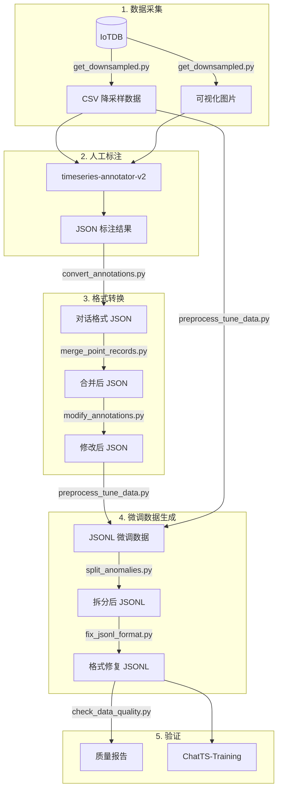

# 数据处理流程

## 概述

本项目支持从原始时序数据到 ChatTS 微调数据的完整处理管道。



---

## 阶段详解

### 阶段 1: 数据采集

**目标**：从 IoTDB 获取原始时序数据并降采样

```bash
python scripts/acquisition/get_downsampled.py
```

**输出路径**：
- CSV: `data_downsampled/数据集{name}_{point}.csv`
- 图片: `picture_data/{point}.jpg`

---

### 阶段 2: 人工标注

**目标**：使用可视化工具进行异常区间标注

**工具**：[timeseries-annotator-v2](/home/douff/ts/timeseries-annotator-v2)

**输出格式**：JSON 文件，包含 annotations 和 overall_attribute

---

### 阶段 3: 格式转换

**目标**：将标注 JSON 转换为对话格式

```bash
# 步骤 1: 转换为对话格式
python scripts/transformation/convert_annotations.py

# 步骤 2: 合并同点位记录
python scripts/transformation/merge_point_records.py

# 步骤 3: 修改标注（扩展区间、添加无异常等）
python scripts/transformation/modify_annotations.py
```

---

### 阶段 4: 微调数据生成

**目标**：生成 ChatTS 训练格式的 JSONL 文件

```bash
# 步骤 1: 合并 JSON 标注与 CSV 时序数据
python scripts/preprocessing/preprocess_tune_data.py

# 步骤 2: 拆分多异常样本（可选）
python scripts/preprocessing/split_anomalies.py data/train.jsonl -o data/train_split.jsonl

# 步骤 3: 修复格式问题
python scripts/preprocessing/fix_jsonl_format.py data/train_split.jsonl data/train_final.jsonl
```

**JSONL 格式**：
```json
{
  "input": "<ts><ts/>\n请分析...",
  "output": "{\"status\":\"success\",\"detected_anomalies\":[...]}",
  "timeseries": [[1.2, 3.4, 5.6, ...]]
}
```

---

### 阶段 5: 验证

**目标**：确保数据质量和一致性

```bash
# 检查 JSONL 数据质量
python scripts/validation/check_data_quality.py

# 验证转换一致性
python scripts/validation/verify_conversion.py
```

---

## 常见问题

### Q: CSV 文件找不到？
检查 `preprocess_tune_data.py` 中的文件名映射规则，可能需要添加新的前缀处理。

### Q: 异常数量不匹配？
运行 `verify_conversion.py` 检查一致性，确认 `merge_point_records.py` 是否正确合并。

### Q: 训练时报格式错误？
运行 `fix_jsonl_format.py` 确保 `<ts><ts/>` 占位符存在且 output 为字符串类型。
